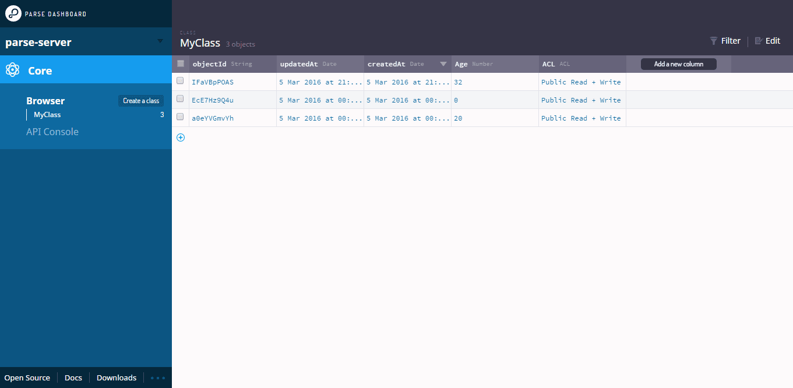

# Parse-Server

`parse-server` 快速部署，假设本地已经配置好 `docker` 和 `docker-compose`。

修改 .env 文件，如下所示，其中 localhost 修改为本地 IP 地址。

```ini
BASE_URL=http://localhost
TEST_URL=http://localhost:4040/login
SOFTWARE_VERSION_TAG=latest
ADMIN_USERNAME=admin
ADMIN_PASSWORD=admin@123
ADMIN_EMAIL=admin@admin.com
PARSE_SERVER_APPLICATION_ID=admin-app-id
MASTER_KEY=admin-master-key
APP_NAME=MyApp
```

然后执行 `docker-compose up -d` 即可，然后打开 `http://{ip}:4040/apps/MyApp/browser/`，新增一个Class为 `GameScore`。

执行命令，新增一条数据，并查看数据是否新增成功。

```shell
curl -X POST \
-H "X-Parse-Application-Id: admin-app-id" \
-H "Content-Type: application/json" \
-d '{"score":1337,"playerName":"Sean Plott","cheatMode":false}' \
http://localhost:1337/parse/classes/GameScore

{"objectId":"7amBIuzAZW","createdAt":"2024-07-23T08:36:15.074Z"}
```


# Parse CI/CD pipeline

<a href="https://dash.elest.io/deploy?source=cicd&social=dockerCompose&url=https://github.com/elestio-examples/parse"></a>

Deploy Parse server with CI/CD on Elestio


<br/>
<br/>

# Once deployed ...

You can open Parse UI here:

    URL: https://[CI_CD_DOMAIN]
    email: [ADMIN_EMAIL]
    password: [ADMIN_PASSWORD]
